# Pbit

<p align="center">
  
  
  
  
</p>

<p align="center">
  <strong>Probabilistic p-bit optimization, low-precision gradient robustness, and reproducible optimizer benchmarking.</strong>
</p>

<p align="center">
  <a href="#installation">Install</a> &nbsp;•&nbsp;
  <a href="#quickstart">Quickstart</a> &nbsp;•&nbsp;
  <a href="#benchmarks">Benchmarks</a> &nbsp;•&nbsp;
  <a href="#api">API</a> &nbsp;•&nbsp;
  <a href="#what-this-is">Scope</a> &nbsp;•&nbsp;
  <a href="#contributing">Contributing</a>
</p>

---

<div align="center">
  
</div>

---

## Installation

```bash
pip install pbit            # NumPy core
pip install "pbit[bench]"   # + matplotlib / pandas / tqdm for report helpers
pip install "pbit[torch]"   # + PyTorch optimizer wrapper
```

Requires **Python >= 3.11**. Runtime dependency: `numpy`.

---

## Quickstart

```python
from pbit.optim import PBitOptimizer

opt = PBitOptimizer(lr=0.01, beta0=2.0, tau=150.0, seed=42)
for t in range(500):
    g = grad(x)
    x = opt.step(x, g, t)
```

Low-precision stress test across optimizers:

```python
from pbit.bench import Experiment, Rastrigin, QuantizeNoise
from pbit.bench.specs import OptimizerSpec
from pbit.optim import Adam, PBitOptimizer, SGD

report = Experiment({
    "functions": [Rastrigin(dim=2)],
    "noises": [None, QuantizeNoise(bits=1, stochastic=True)],
    "optimizers": [
        OptimizerSpec("pbit", lambda: PBitOptimizer(lr=0.05, tau=300, step_size="floor", floor=1e-3)),
        OptimizerSpec("adam", lambda: Adam(lr=0.05)),
        OptimizerSpec("sgd", lambda: SGD(lr=0.05)),
    ],
    "max_iter": 500, "n_runs": 10, "seed": 42,
}).run()

print(report.summary())
report.to_csv("out/results.csv")
report.to_json("out/results.json")
```

Optional PyTorch optimizer:

```bash
pip install "pbit[torch]"
```

```python
from pbit.torch import PBitTorchOptimizer

optimizer = PBitTorchOptimizer(model.parameters(), lr=1e-3, tau=1000)
```

---

## Benchmarks

<div align="center">
  
</div>

### Convergence on Different Landscapes

| Function | Optimizer | Iter to threshold | AUC Loss | Final variance |
|----------|-----------|-------------------|----------|----------------|
| **Rosenbrock** | **PBit** | **51** | 11.74 | 0.638 |
| Rosenbrock | Adam | 180 | 15.31 | 0.001 |
| Rosenbrock | RMSProp | 156 | 21.27 | 0.000 |
| Rastrigin | RMSProp | 500 | 1.96 | 1.030 |
| Rastrigin | **PBit** | 500 | 3.99 | **4.39** |
| Ackley | EvoStrat | 80 | 0.67 | 0.012 |

### Noise Robustness

| Noise | Optimizer | Rastrigin final loss | Degradation |
|-------|-----------|----------------------|-------------|
| Clean | PBit | 23.94 | — |
| 4-bit Quant | **PBit** | **11.69** | **0.49x** (improved!) |
| 4-bit Quant | Adam | 20.30 | 0.99x |
| Sign (1-bit) | **PBit** | 21.01 | 0.88x |
| Sign (1-bit) | Adam | 11.34 | 0.55x |

Full results: [`results_and_conclusion.md`](results_and_conclusion.md)

---

## Why p-bit optimization?

Modern optimization is moving toward low-precision, noisy, energy-constrained
hardware. `pbit` is naturally stochastic and binary-directional: each
parameter update is a Bernoulli decision `σ ∈ {−1, +1}` whose probability
follows a Boltzmann distribution, modulated by an inverse-temperature
annealing schedule. The result is an optimizer that is structurally at home
with quantized/noisy gradients, while still behaving like gradient descent as
it cools.

<div align="center">
  
</div>

### Key properties

- **Binary direction**: each coordinate flips with probability `P(+1) = σ(−β · g / ḡ)`
- **Annealing**: inverse temperature `β(t) = min(β₀(1 + t/τ), βcap)` rises over time
- **Gradient-proportional magnitude**: step size scales with `|grad|` (or constant / floored)
- **Low-precision native**: stochastic binary decisions are naturally compatible with 1–4 bit gradients
- **Thermodynamic diagnostics**: track `beta`, flip probability, and entropy per step

---

## API Reference

### Optimizers

#### `PBitOptimizer`

```python
from pbit.optim import PBitOptimizer

opt = PBitOptimizer(
    lr=0.01,                # base learning rate
    beta0=2.0,              # initial inverse temperature
    tau=150.0,              # cooling timescale
    beta_cap=50.0,          # max inverse temperature
    step_size="proportional",  # "proportional", "constant", or "floor"
    floor=0.0,              # magnitude floor (for "floor" mode)
    seed=42,                # random seed
    lr_schedule=None,       # optional callable(t) -> lr
)
x_next = opt.step(x, grad, t)
state = opt.state_dict()
```

**Step-size modes:**
- `proportional` (default): `step = lr * (|grad| + eps) * sigma`
- `constant`: `step = lr * sigma`
- `floor`: `step = lr * (|grad| + floor + eps) * sigma`

**Learning rate scheduling:**
```python
def lr_schedule(t):
    return 0.01 * (0.99 ** t)

opt = PBitOptimizer(lr=0.01, lr_schedule=lr_schedule)
```

#### Baselines

All implement `GradientOptimizer` protocol (`reset(rng)`, `step(x, grad, t)`):

- `SGD`, `Momentum`, `Adam`, `AdamW`, `RMSProp`, `SignSGD`, `Lion`, `Langevin`

#### Ask/Tell

- `SimulatedAnnealing`, `EvolutionStrategy` — implement `AskTellOptimizer` protocol

### Benchmarking

#### `Experiment`

```python
from pbit.bench import Experiment, Rastrigin, QuantizeNoise
from pbit.bench.specs import OptimizerSpec

report = Experiment({
    "functions": [Rastrigin(dim=2)],
    "noises": [None, QuantizeNoise(bits=4, stochastic=True)],
    "optimizers": [
        OptimizerSpec("pbit", lambda: PBitOptimizer()),
        OptimizerSpec("adam", lambda: Adam()),
    ],
    "max_iter": 500,
    "n_runs": 10,
    "seed": 42,
}).run()
```

#### `Report`

```python
print(report.summary())          # ASCII table
report.to_csv("results.csv")     # tidy CSV
report.to_json("results.json")   # full JSON with metadata

# Access raw rows (for plotting / inspection)
for row in report.rows:
    print(row.optimizer, row.best_history[-1])
```

#### Noise Suite

- `NoNoise` — clean gradients
- `GaussianNoise(sigma)` — additive Gaussian
- `CorruptionNoise(p, amplify)` — random sign flips + amplification
- `QuantizeNoise(bits, stochastic)` — uniform quantization with optional randomized rounding
- `SignNoise` — 1-bit sign-only gradients
- `ClipNoise(max_norm)` — gradient norm clipping

#### Metrics

- `success_rate(best_histories, threshold)` — fraction of runs reaching threshold
- `median_hit_time_successes(best_histories, threshold)` — median iteration to reach threshold (successful runs only)
- `iter_to_threshold(best_history, threshold)` — first iteration crossing threshold
- `auc_loss(history)` — area under loss curve
- `robustness_ratio(noisy, clean)` — noisy_final / clean_final
- `escape_count_current(mean_current)` — count of plateau escapes

### PyTorch Integration

```python
from pbit.torch import PBitTorchOptimizer

optimizer = PBitTorchOptimizer(
    model.parameters(),
    lr=1e-3,
    tau=1000,
    step_size="proportional",
)
```

---

## How It Works

The p-bit optimizer replaces deterministic gradient descent direction with a
stochastic binary decision driven by thermodynamic annealing:

1. **Normalize** gradient by its mean absolute value: `ḡ = mean(|grad|) + ε`
2. **Compute flip probability** via Boltzmann sigmoid: `P(+1) = σ(−β · grad / ḡ)`
3. **Sample binary direction**: `σ ~ Bernoulli(P(+1)) ∈ {+1, −1}`
4. **Take step**: `x ← x + lr · |grad| · σ`
5. **Anneal**: increase `β` over time using `schedule(t)`

Early in optimization (`β` small), directions are nearly random — providing
exploration. As `β` grows, the optimizer locks onto descent directions —
providing exploitation. This makes it naturally robust to:
- **Quantization noise** — stochastic rounding is part of the model
- **Sign-only gradients** — binary direction is the native representation
- **Corrupted gradients** — random flips are indistinguishable from high-temperature exploration

---

## Project Structure

```
pbit/
├── pbit/
│   ├── __init__.py
│   ├── _version.py
│   ├── config.py
│   ├── core/
│   │   ├── probability.py      # sigmoid, bernoulli_bit, entropy
│   │   ├── schedule.py         # linear_cooling, constant schedules
│   │   └── rng.py              # SHA256-derived deterministic RNG streams
│   ├── optim/
│   │   ├── pbit.py             # PBitOptimizer
│   │   ├── baselines.py        # SGD, Adam, AdamW, RMSProp, SignSGD, Lion, Langevin
│   │   ├── ask_tell.py         # SimulatedAnnealing, EvolutionStrategy
│   │   └── base.py             # GradientOptimizer, AskTellOptimizer protocols
│   ├── bench/
│   │   ├── experiment.py       # Experiment runner with tqdm progress
│   │   ├── report.py           # Report aggregation, CSV/JSON export
│   │   ├── metrics.py          # success_rate, auc_loss, robustness_ratio, etc.
│   │   ├── noise.py            # QuantizeNoise, SignNoise, GaussianNoise, etc.
│   │   ├── functions.py        # Rastrigin, Ackley, Rosenbrock
│   │   ├── specs.py            # FunctionSpec, NoiseSpec, OptimizerSpec
│   │   ├── plot.py             # matplotlib visualization helpers
│   │   └── compare.py          # ReportDiff, compare_reports
│   ├── torch/
│   │   └── optimizer.py        # PBitTorchOptimizer
│   └── utils/
│       ├── io.py               # atomic writes
│       └── timing.py           # Timer, TimingStats
├── tests/                      # 65+ tests, all passing
├── examples/                   # demo scripts
├── assets/                     # SVG assets for README
├── pyproject.toml
├── README.md
├── LICENSE
└── results_and_conclusion.md
```

---

## What This Is / Is Not

**This is:**
- A focused, NumPy-first research/engineering tool for probabilistic optimization
- An honest benchmarking harness that separates measured time from declared cost
- A library for exploring low-precision, noisy-gradient optimization regimes

**This is not:**
- An LLM optimizer
- A hardware emulator
- A GPU-backed library
- A production training library for standard deep learning

---

## Examples

See the `examples/` directory:

- `demo_optimizer.py` — classic optimization with PBit on Rastrigin and Rosenbrock
- `run_benchmark.py` — full reproducible optimizer benchmark across functions and noise modes
- `noise_sweep.py` — quantization bit-width sweep
- `compare_two_reports.py` — explain why two benchmark runs differ
- `pytorch_mlp.py` — PyTorch integration example

Run a demo:
```bash
python examples/demo_optimizer.py
python examples/run_benchmark.py
```

---

## Contributing

Contributions are welcome. Please:

1. Fork the repo and create a feature branch
2. Add tests for any new functionality
3. Ensure `ruff` and `pytest` pass
4. Open a pull request with a clear description

### Development Setup

```bash
git clone https://github.com/grunchielabs/pbit.git
cd pbit
pip install -e ".[dev]"
pytest tests/ -v
ruff check pbit tests
```

---

## License

Apache-2.0 — the explicit patent grant is intentional for hardware-adjacent work.

See [LICENSE](LICENSE) for details.

---

<div align="center">
  
</div>
